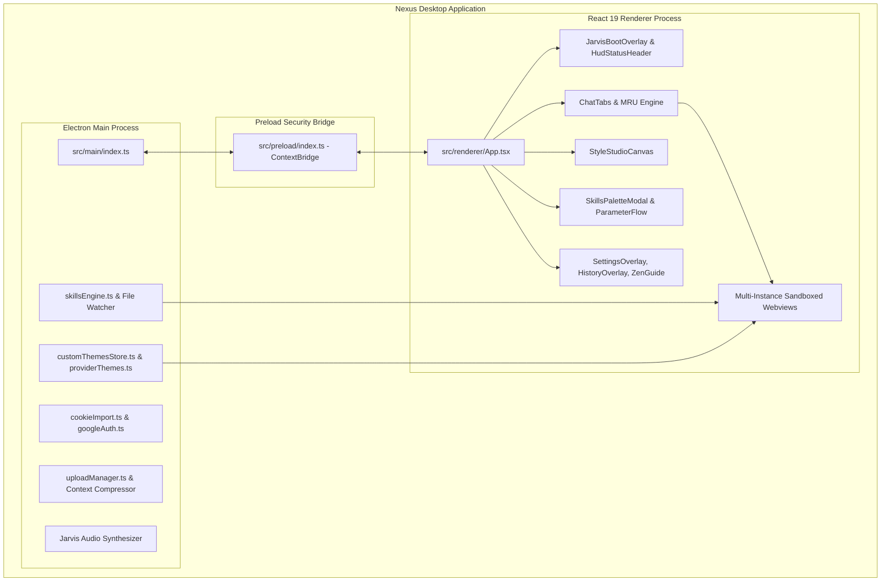

<div align="center">

# ⚡ N E X U S

### The Cybernetic Multi-Provider AI Desktop Command Center

[](https://github.com/a1sadeq/nexus/releases/latest)
[](https://github.com/a1sadeq/nexus/releases/latest)
[](LICENSE)
[](https://www.electronjs.org/)
[](https://react.dev/)
[](https://www.typescriptlang.org/)
[](https://tailwindcss.com/)

<p align="center">
  <b>Unify your AI workspace. Stop drowning in browser tabs. Command all your frontier models from a single, keyboard-driven native HUD.</b>
</p>

[⬇️ Download v1.0.0](https://github.com/a1sadeq/nexus/releases/latest) • [⚡ Features](#-tactical-feature-matrix) • [🏗️ Architecture](#%EF%B8%8F-system-architecture) • [⌨️ Shortcuts](#%EF%B8%8F-zen-mode-keyboard-matrix) • [🚀 Quickstart](#-quickstart--installation)

---

</div>

## 🌌 The Vision

AI development today is fragmented. Developers juggle dozens of separate browser tabs between ChatGPT, Claude, Gemini, DeepSeek, and Perplexity. Sessions expire, CAPTCHAs interrupt flow, dark mode styling is inconsistent across sites, and injecting code context requires manual copy-pasting.

**Nexus** transforms this chaotic experience into a unified, high-octane desktop command center. Engineered with an **Iron Man Jarvis HUD aesthetic**, native webview multi-threading, automated cookie sync, live CSS theming, and an extensible local AI Skills Engine, Nexus is built for engineers, security researchers, and power users who demand zero friction.

---

## 📦 Quick Downloads (v1.0.0 Genesis)

| Platform | Format | Package | Install Command |
| :--- | :--- | :--- | :--- |
| **Linux (Universal)** | Portable AppImage | [**`nexus-1.0.0.AppImage`**](https://github.com/a1sadeq/nexus/releases/download/v1.0.0/nexus-1.0.0.AppImage) | `chmod +x nexus-1.0.0.AppImage && ./nexus-1.0.0.AppImage` |
| **Debian / Ubuntu / Mint** | Native `.deb` | [**`nexus_1.0.0_amd64.deb`**](https://github.com/a1sadeq/nexus/releases/download/v1.0.0/nexus_1.0.0_amd64.deb) | `sudo dpkg -i nexus_1.0.0_amd64.deb` |
| **Arch Linux / Manjaro** | Native `.pacman` | [**`nexus-1.0.0.pacman`**](https://github.com/a1sadeq/nexus/releases/download/v1.0.0/nexus-1.0.0.pacman) | `sudo pacman -U nexus-1.0.0.pacman` |
| **Windows 10 / 11** | NSIS Setup | [**`nexus-1.0.0-setup.exe`**](https://github.com/a1sadeq/nexus/releases/download/v1.0.0/nexus-1.0.0-setup.exe) | Double-click to install with desktop integration |

> 🔒 *All release binaries are signed with SHA-256 integrity checksums. Verify against [`SHA256SUMS.txt`](https://github.com/a1sadeq/nexus/releases/download/v1.0.0/SHA256SUMS.txt).*

---

## ⚡ Tactical Feature Matrix

### 1. 🎛️ Unified Multi-Provider Orchestrator
- Seamlessly run and hot-swap across frontier AI providers:
  - 🟢 **ChatGPT** (GPT-4o, o1, o3-mini)
  - 🟣 **Claude** (Sonnet 3.5, Opus 3, Haiku 3.5)
  - 🔵 **Google Gemini** (Gemini 2.0 Flash, 1.5 Pro)
  - 🐋 **DeepSeek** (DeepSeek V3, DeepSeek R1)
  - 🌐 **Perplexity AI** (Sonar reasoning & search)
  - 🦙 **Grok (xAI)** & Custom Web Endpoints
- Isolated session storage partitions keep chats persistent and stateful.
- Instant MRU (Most Recently Used) tab switcher via `Ctrl+Tab` / `Ctrl+Shift+Tab`.

### 2. 🤖 Jarvis Tactical HUD & Audio Synthesizer
- **Futuristic Boot Sequence**: Interactive boot animation with sound effects and hardware initialization telemetry.
- **Synthesized Audio Cues**: Real-time auditory feedback for tab switching, skill execution, HUD toggle, and error states.
- **Cyberpunk Status Bar**: Live CPU/Memory telemetry, active provider latency markers, and security session indicators.

### 3. 🎨 Style Studio & Dynamic CSS Theming
- **Live DOM Token Extraction**: Probe active AI webviews in real time to capture live CSS classes, bubble selectors, and color tokens.
- **Custom Theme Injection**: Apply dark obsidian themes, snug chat bubble spacing, syntax highlight themes, and custom font overrides that persist across reloads.
- **Live Prompt Generator**: Export ready-to-paste AI prompts instructing LLMs to generate pixel-perfect custom CSS skins for Nexus.

### 4. 🧠 Extensible AI Skills Engine
- **Local Automation Scripting**: Define custom AI skills that execute structured prompt chains, parameter extraction, and workflow pipelines.
- **Live File Watcher**: Automatically monitor local project folders and pipe file changes directly into active AI chat sessions.
- **Modal Input Stacking**: Fluid parameter modals (`Ctrl+K`) for parameterized prompts, codebase audits, and multi-step reasoning.

### 5. 📁 Codebase Context Compressor
- Select any project directory or codebase subfolder.
- Automatically ignore binaries, node_modules, lockfiles, and `.git` caches.
- Compress multi-file projects into a token-optimized markdown payload structured specifically for LLM context windows.

### 6. 🔑 One-Click Session & Cookie Sync
- Skip repetitive 2FA, SMS verification, and Cloudflare CAPTCHAs.
- Seamlessly import authenticated sessions from **Google Chrome** and **Brave Browser**.
- Encrypted local cookie storage keeps your credentials strictly on your device.

---

## 🏗️ System Architecture



---

## ⌨️ Zen Mode Keyboard Matrix

Master Nexus entirely from your keyboard with zero mouse latency:

| Shortcut | Scope | Action |
| :--- | :--- | :--- |
| <kbd>Ctrl</kbd> + <kbd>T</kbd> | Global | Open New AI Tab / Provider Palette |
| <kbd>Ctrl</kbd> + <kbd>W</kbd> | Global | Close Current Tab |
| <kbd>Ctrl</kbd> + <kbd>Tab</kbd> | Global | Cycle Tabs (Most Recently Used Order) |
| <kbd>Ctrl</kbd> + <kbd>Shift</kbd> + <kbd>Tab</kbd> | Global | Cycle Tabs Backward |
| <kbd>Alt</kbd> + <kbd>1</kbd> .. <kbd>9</kbd> | Global | Jump Directly to Tab 1 through 9 |
| <kbd>Ctrl</kbd> + <kbd>K</kbd> | Global | Open AI Skills & Action Palette |
| <kbd>Ctrl</kbd> + <kbd>B</kbd> | Global | Toggle Collapsible Side Navigation Bar |
| <kbd>Ctrl</kbd> + <kbd>Shift</kbd> + <kbd>S</kbd> | Global | Open Style Studio & CSS Theming Canvas |
| <kbd>Ctrl</kbd> + <kbd>,</kbd> | Global | Open Settings & Session Sync Overlay |
| <kbd>Ctrl</kbd> + <kbd>H</kbd> | Global | Open Searchable Tab History HUD |
| <kbd>Ctrl</kbd> + <kbd>U</kbd> | Global | Open Codebase Folder Context Compressor |
| <kbd>F11</kbd> | Global | Toggle Zen Mode Fullscreen |
| <kbd>Esc</kbd> | Active Modal | Dismiss Any Modal / Return Focus to Webview |

---

## 🚀 Quickstart & Installation

### Option 1: Prebuilt Packages (Recommended)
Download the latest installer or package for your OS directly from [**GitHub Releases**](https://github.com/a1sadeq/nexus/releases/latest).

#### Debian / Ubuntu / Linux Mint
```bash
wget https://github.com/a1sadeq/nexus/releases/download/v1.0.0/nexus_1.0.0_amd64.deb
sudo dpkg -i nexus_1.0.0_amd64.deb
nexus
```

#### Arch Linux / Manjaro
```bash
wget https://github.com/a1sadeq/nexus/releases/download/v1.0.0/nexus-1.0.0.pacman
sudo pacman -U nexus-1.0.0.pacman
nexus
```

#### Standalone AppImage (Any Linux)
```bash
wget https://github.com/a1sadeq/nexus/releases/download/v1.0.0/nexus-1.0.0.AppImage
chmod +x nexus-1.0.0.AppImage
./nexus-1.0.0.AppImage
```

---

### Option 2: Build From Source

```bash
# 1. Clone the repository
git clone https://github.com/a1sadeq/nexus.git
cd nexus

# 2. Install dependencies
npm install

# 3. Launch in development mode
npm run dev

# 4. Build distribution packages
npm run build:linux   # For Linux (.AppImage, .deb, .pacman, .snap)
npm run build:win     # For Windows (.exe)
npm run build:mac     # For macOS (.dmg)
```

---

## 🛠️ Tech Stack & Dependencies

- **Runtime**: [Electron 43](https://electronjs.org/)
- **Frontend Core**: [React 19](https://react.dev/), [TypeScript 5.9](https://www.typescriptlang.org/)
- **Bundler & Tooling**: [Vite 7](https://vitejs.dev/), [electron-vite](https://electron-vite.org/)
- **Styling**: [Tailwind CSS 4](https://tailwindcss.com/), [PostCSS](https://postcss.org/)
- **Icons & UI**: [Lucide React](https://lucide.dev/), Custom Cyberpunk SVG Assets
- **Packaging**: [electron-builder](https://www.electron.build/)
- **Testing**: [Vitest](https://vitest.dev/) (100% Passing Unit & Integration Suite)

---

## 🛡️ Security & Privacy Philosophy

- **Zero Cloud Intermediaries**: Nexus does not proxy your traffic through third-party servers. All requests flow directly between your machine and your chosen AI providers.
- **Local Credentials**: Synced browser cookies and local themes remain strictly in your local operating system user storage.
- **Process Isolation**: Each AI webview is sandboxed with context isolation enabled and Node.js integration disabled.

---

## 📄 License

Distributed under the **MIT License**. See [`LICENSE`](LICENSE) for more information.

<div align="center">
  <sub>Built with ⚡ by <a href="https://github.com/a1sadeq">Amr Elsadek (a1sadeq)</a> and the Antigravity engineering team.</sub>
</div>
