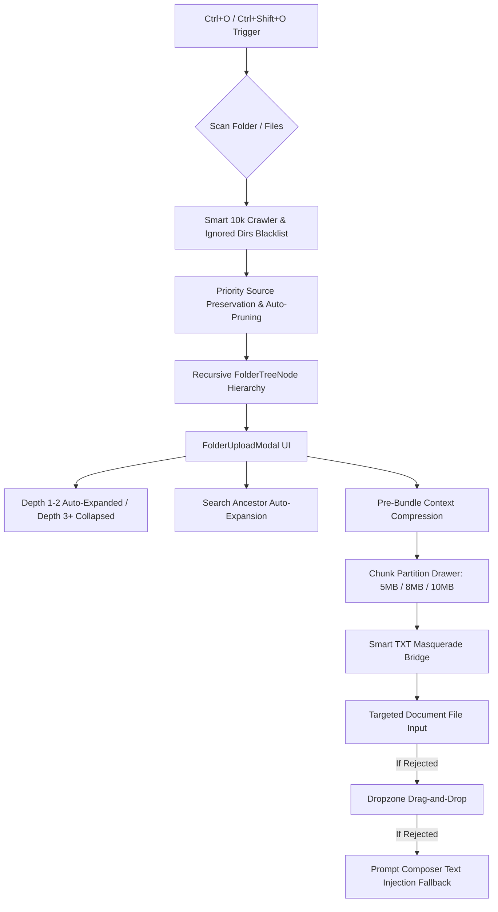

# Nexus Folder Upload Architecture v2: Grilling Spec & Master Design

**Date:** 2026-10-07  
**Status:** Approved via /grill-me  
**Author:** Antigravity AI & Amr Elsadek  
**Target Subsystems:** `uploadManager`, `FolderUploadModal`, `folderUploadHelpers`  
**Design Standard:** UI/UX Pro Max Cyberpunk HUD / Obsidian Glassmorphism  

---

## 1. Executive Summary

Following a deep `/grill-me` architectural review across every branch of the upload subsystem, this specification details the complete solution to eliminate all upload extension errors, provide true recursive tree navigation, scale repository scanning to 10,000 files without user refusal, and introduce an interactive pre-bundle compression and chunk partitioning station.

---

## 2. Architectural Pillars

---

## 3. Dedicated Task Plans Breakdown

1. **Plan 1**: `docs/plans/2026-10-07-upload-delivery-and-masquerade-plan.md`
   - Extension error elimination, smart `.txt` masquerading, document input targeting, multi-tier fallback.
2. **Plan 2**: `docs/plans/2026-10-07-hierarchical-tree-and-depth-control-plan.md`
   - True recursive `FolderTreeNode` structure, cascading check/uncheck, depth 1-2 expansion, global expand/collapse toggle.
3. **Plan 3**: `docs/plans/2026-10-07-scanner-capacity-and-auto-pruning-plan.md`
   - 10,000 files capacity, enriched developer ignore blacklist, smart prioritization avoiding refusal.
4. **Plan 4**: `docs/plans/2026-10-07-bundle-compression-and-partition-manager-plan.md`
   - Pre-bundle compression, interactive chunks partition drawer, 5/8/10MB dials, single large file slicing, paced automated upload.
